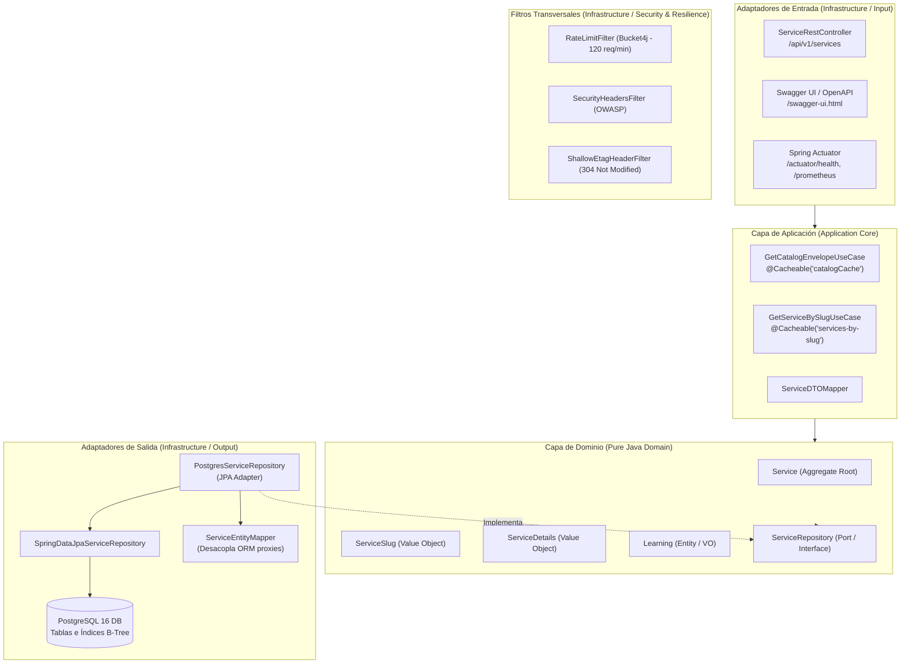

# AWS Cloud Services API

API REST construida con Java 21 y Spring Boot 3 que expone un catálogo normalizado de 280 servicios de AWS, 22 categorías y su mapeo hacia las 13 certificaciones oficiales vigentes.

## Características

- **Catálogo normalizado:** 280 servicios con metadatos técnicos (`cli_namespace`, `deployment_model`, `scope`) y enlaces a documentación, consola y precios.
- **Mapeo pedagógico:** Sinergias arquitectónicas y consejos de examen alineados a las 13 certificaciones oficiales de AWS (CLF-C02, SAA-C03, SAP-C02, etc.).
- **Optimización de consultas:** Batch fetching con Hibernate (`@BatchSize(50)`) para mitigar el problema de consultas N+1 en colecciones.
- **Rendimiento y red:** Caché L1 en memoria con Caffeine, validación condicional con cabecera `ETag` (HTTP 304) y compresión Gzip.
- **Control de tráfico:** Rate limiting con Bucket4j (120 req/min por IP) y cabeceras de seguridad HTTP básicas.

## Stack Tecnológico

- **Lenguaje:** Java 21 (LTS)
- **Framework:** Spring Boot 3 / 4 (Spring WebMvc, Spring Data JPA)
- **Base de datos:** PostgreSQL 16
- **Migraciones:** Flyway
- **Caché y Resiliencia:** Caffeine, Bucket4j
- **Documentación:** Springdoc OpenAPI 3.0 / Swagger UI
- **Métricas:** Spring Boot Actuator, Micrometer Prometheus
- **Contenedores:** Docker

## Arquitectura

El proyecto sigue una arquitectura hexagonal (puertos y adaptadores) para aislar el dominio de las dependencias de infraestructura y persistencia.



### Estructura de Paquetes

```text
com.aws.dashboard.api/
├── domain/                               # Modelo de dominio puro (sin dependencias de frameworks)
│   ├── model/                            # Entidades y Value Objects (Service, ServiceSlug, Details...)
│   └── repository/                       # Interfaces de repositorio (puertos de salida)
├── application/                          # Lógica de aplicación
│   ├── dto/                              # Records DTO inmutables
│   └── usecase/                          # Casos de uso (GetCatalogEnvelopeUseCase, GetServiceBySlugUseCase)
└── infrastructure/                       # Adaptadores técnicos
    ├── adapter/
    │   ├── input/rest/                   # Controladores REST, GlobalExceptionHandler (RFC 7807)
    │   └── output/persistence/           # Entidades JPA, Repositorios Spring Data, Mappers
    └── config/                           # Filtros, Jackson, OpenAPI, Caffeine, DataLoader
```

## Instalación y Ejecución

### Requisitos

- JDK 21
- Docker y Docker Compose

### 1. Iniciar Base de Datos

```bash
docker compose up -d
```

### 2. Ejecutar la Aplicación

Al iniciar con la base de datos vacía, `DataDataLoader` poblará automáticamente los 280 servicios y 22 categorías desde `aws_api_sanitized.json`.

```bash
./mvnw spring-boot:run
```

En Windows:

```powershell
.\mvnw spring-boot:run
```

La API estará disponible en `http://localhost:8080`.

## Variables de Entorno

| Variable | Valor por Defecto | Descripción |
| :--- | :--- | :--- |
| `SPRING_DATASOURCE_URL` | `jdbc:postgresql://localhost:5432/aws_catalog_db` | URL JDBC de conexión |
| `SPRING_DATASOURCE_USERNAME` | `catalog_user` | Usuario de base de datos |
| `SPRING_DATASOURCE_PASSWORD` | `catalog_password_2026` | Contraseña de base de datos |
| `SERVER_PORT` | `8080` | Puerto HTTP (`${PORT:8080}`) |
| `SPRING_PROFILES_ACTIVE` | `default` | Perfil de configuración (`default`, `prod`) |
| `HIKARI_MAX_POOL_SIZE` | `5` | Conexiones máximas en el pool |
| `HIKARI_MIN_IDLE` | `2` | Conexiones mínimas inactivas |
| `TOMCAT_MAX_THREADS` | `30` | Hilos máximos del servidor |

## Documentación OpenAPI / Swagger

- **Swagger UI:** [http://localhost:8080/swagger-ui.html](http://localhost:8080/swagger-ui.html)
- **Especificación OpenAPI (JSON):** [http://localhost:8080/v3/api-docs](http://localhost:8080/v3/api-docs)

## Endpoints

### 1. Catálogo de Servicios

```http
GET /api/v1/services
```

Admite dos modalidades de consumo:

1. **Carga completa (para filtrado en cliente):** Al omitir `page` y `limit`, retorna los 280 servicios en una sola llamada (~35 KB con Gzip) para almacenamiento local y búsqueda sin latencia de red.
2. **Paginación en servidor:** Permite fragmentar el catálogo mediante parámetros de consulta.

| Parámetro Query | Tipo | Requerido | Valor por Defecto | Descripción |
| :--- | :---: | :---: | :---: | :--- |
| `page` | `Integer` | No | `1` | Índice de página (1-based). Valores `<= 0` se normalizan a 1. |
| `limit` | `Integer` | No | `280` | Cantidad de servicios por página. |

#### Estructura de Respuesta (Envelope)

```json
{
  "info": {
    "name": "AWS Services API",
    "version": "1.0.0",
    "total_categories": 22,
    "total_services": 280,
    "updated_at": "2026-09-24T00:00:00Z"
  },
  "pagination": {
    "total": 280,
    "page": 1,
    "limit": 20,
    "pages": 14,
    "has_more": true,
    "next_cursor": null,
    "next": "/api/v1/services?page=2&limit=20",
    "prev": null
  },
  "results": [ ... ]
}
```

**Ejemplos cURL:**

```bash
# Catálogo paginado
curl -i "http://localhost:8080/api/v1/services?page=1&limit=20"

# Validación condicional ETag (retorna 304 Not Modified si no hubo cambios)
curl -i -H 'If-None-Match: "0edd8c05bc4ca7ef925ac2bf27e342252"' "http://localhost:8080/api/v1/services?page=1&limit=20"
```

### 2. Detalle por Slug

```http
GET /api/v1/services/{slug}
```

Retorna la ficha técnica de un servicio específico (URLs oficiales, precios, sinergias y tips de examen).

```bash
curl -i "http://localhost:8080/api/v1/services/amazon-simple-storage-service"
```

### 3. Códigos de Respuesta HTTP (RFC 7807)

| Código | Estado | Escenario |
| :---: | :--- | :--- |
| `200` | OK | Petición procesada correctamente. |
| `304` | Not Modified | La versión en caché coincide con el ETag actual. |
| `400` | Bad Request | Parámetros de consulta no válidos. |
| `404` | Not Found | Servicio no encontrado para el slug provisto. |
| `429` | Too Many Requests | Límite de tasa excedido (120 req/min por IP). |
| `500` | Internal Server Error | Error no controlado (formato `ProblemDetail` sin exponer trazas internas). |

## Observabilidad

- **Health check:** `GET /actuator/health`
- **Sonda Liveness:** `GET /actuator/health/liveness`
- **Sonda Readiness:** `GET /actuator/health/readiness`
- **Métricas Prometheus:** `GET /actuator/prometheus`

## Pruebas

```bash
./mvnw test -Dtest="!AwsServicesApiApplicationTests"
```

*(Nota: `AwsServicesApiApplicationTests` requiere un daemon local de Docker para Testcontainers).*

## Licencia

Distribuido bajo licencia Apache 2.0. Consulta el archivo `LICENSE` para más información.
