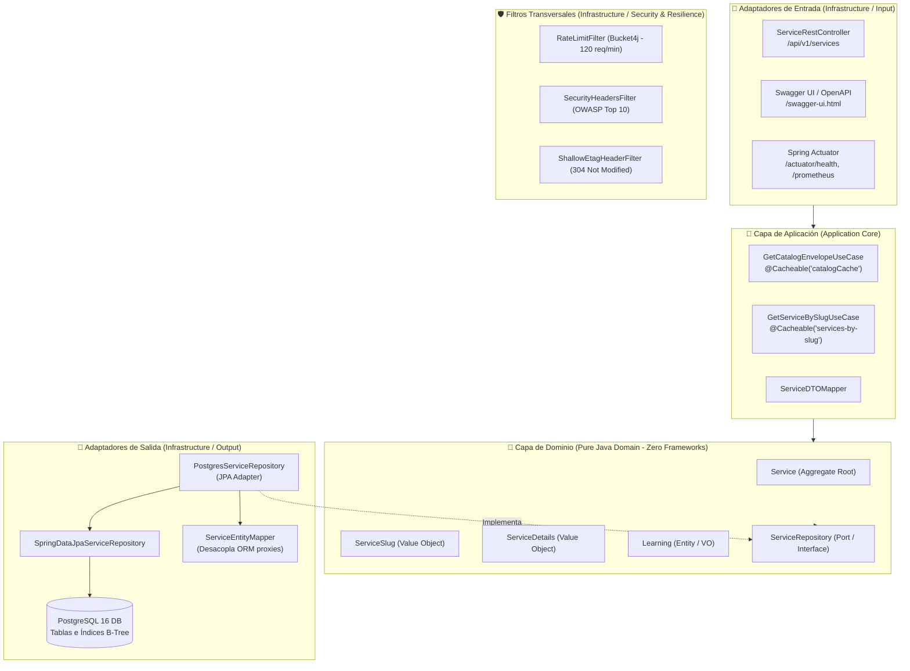

# AWS Cloud Services API ☁️⚡

> **Enciclopedia Técnica y Catálogo de Servicios de Amazon Web Services**  
> API RESTful de grado de producción, alta concurrencia y baja latencia desarrollada en **Java 21** y **Spring Boot 3 / 4**, diseñada bajo principios de **Arquitectura Hexagonal (Puertos y Adaptadores)** y **Domain-Driven Design (DDD)**.

---

## 📋 Visión General del Proyecto

Inspirada en el modelo de catálogos interactivos exhaustivos, este backend provee una fuente canónica, normalizada y enriquecida con información técnica sobre **280 servicios oficiales de AWS** organizados en **22 categorías oficiales**.

A diferencia de catálogos estáticos, esta API ofrece:
- **Metadatos Técnicos Precisos:** Espacio de nombres de AWS CLI (`cli_namespace`), modelos de despliegue (`managed`, `serverless`, `iaas`), alcances operativos (`regional`, `global`) y enlaces directos a consolas, documentación y precios.
- **Pedagogía y Certificaciones:** Mapeo formal hacia las **13 certificaciones oficiales vigentes de AWS** (desde *Cloud Practitioner* y *AI Practitioner* hasta *Solutions Architect*, *Data Engineer* y especialidades), con sinergias arquitectónicas (AWS Well-Architected) y consejos clave de examen.
- **Rendimiento de Nivel Empresarial:** Tiempos de respuesta en submilisegundos mediante caché L1 en memoria (**Caffeine**), soporte nativo de **HTTP ETag** (`304 Not Modified`), compresión **Gzip** y mitigación total de consultas SQL N+1 vía **Hibernate Batch Fetching**.
- **Resiliencia y Seguridad OWASP:** Control de tráfico perimetral mediante **Token Bucket (Bucket4j)** con límite de 120 req/min por IP y cabeceras de seguridad HTTP (*CSP, HSTS, X-Frame-Options, X-Content-Type-Options*).

---

## 🛠️ Stack Tecnológico

| Componente | Tecnología | Versión | Propósito |
| :--- | :--- | :--- | :--- |
| **Lenguaje** | Java OpenJDK | 21 (LTS) | Records inmutables, Pattern Matching, Virtual Threads ready |
| **Framework Base** | Spring Boot | 3.x / 4.x | Inyección de dependencias, configuración automática y WebMvc |
| **Persistencia** | Spring Data JPA / Hibernate | 7.x | Capa ORM optimizada con `@BatchSize` para evitar tormentas N+1 |
| **Base de Datos** | PostgreSQL | 16 (Alpine) | Almacenamiento relacional transaccional ACID |
| **Migraciones** | Flyway Community | 12.x | Versionado automatizado de esquemas e índices B-Tree de alta velocidad |
| **Caché L1** | Caffeine Cache | 3.2.x | Caché en memoria ultrarrápida con políticas W-TinyLFU y TTL de 1 hora |
| **Rate Limiting** | Bucket4j Core | 8.10.x | Algoritmo Token Bucket para prevención de DoS y consumo abusivo |
| **Documentación** | Springdoc OpenAPI / Swagger UI | 2.8.x / 3.x | Documentación interactiva de la API compatible con OpenAPI 3.0 |
| **Observabilidad** | Micrometer + Prometheus + Actuator | Latest | Métricas de rendimiento, estado del pool HikariCP y sondas K8s |
| **Contenedores** | Docker & Docker Compose | Latest | Aislamiento y orquestación local de base de datos |

---

## 🏗️ Arquitectura de Software (Hexagonal / DDD)

El sistema implementa una **Arquitectura Hexagonal (Ports & Adapters)** estricta, desacoplando completamente las reglas del negocio de los frameworks web y de persistencia.



### Organización de Paquetes

```text
com.aws.dashboard.api/
├── domain/                               # NÚCLEO DE DOMINIO (Reglas de negocio puras)
│   ├── model/                            # Entidades y Objetos de Valor (Service, ServiceSlug, Details...)
│   └── repository/                       # Puertos de Salida (ServiceRepository Interface)
├── application/                          # CASOS DE USO Y CONTRATOS DTO
│   ├── dto/                              # Records DTO inmutables (CatalogEnvelopeDTO, ServiceResponseDTO)
│   └── usecase/                          # Orquestación de Casos de Uso (GetCatalogEnvelopeUseCase...)
└── infrastructure/                       # ADAPTADORES TÉCNICOS E INFRAESTRUCTURA
    ├── adapter/
    │   ├── input/rest/                   # Controladores REST, GlobalExceptionHandler (RFC 7807)
    │   └── output/persistence/           # Entidades JPA, Repositorios Spring Data, Mappers
    └── config/                           # Filtros (RateLimit, OWASP), Jackson, Swagger, Caffeine, DataLoader
```

---

## 🚀 Guía de Instalación y Despliegue

### Requisitos Previos
- **JDK 21** o superior instalado y configurado en el `PATH` (`java -version`).
- **Docker** y **Docker Compose** en ejecución (`docker --version`).
- **Git** para clonar el repositorio.

---

### 1. Clonar el Repositorio
```bash
git clone https://github.com/regueira2010/AWS-API-JAVA.git
cd AWS-API-JAVA
```

---

### 2. Iniciar la Base de Datos PostgreSQL
Inicia el contenedor de PostgreSQL con las credenciales y volúmenes preconfigurados:

```bash
docker compose up -d
```

Verifica que el contenedor esté saludable:
```bash
docker compose ps
```

---

### 3. Ingesta Automática y Arranque de la Aplicación
El proyecto incluye un mecanismo idempotente (`DataDataLoader`) que, al arrancar por primera vez y detectar la base de datos vacía, ingesta automáticamente los 280 servicios y 22 categorías desde `aws_api_sanitized.json`.

En Windows (PowerShell):
```powershell
.\mvnw spring-boot:run
```

En Linux / macOS:
```bash
./mvnw spring-boot:run
```

El servidor estará listo en el puerto `8080`:
```text
Tomcat started on port 8080 (http) with context path '/'
Started AwsServicesApiApplication in 13.5 seconds
Catalog database already initialized with 280 services.
```

---

## ⚙️ Variables de Entorno y Configuración

Puedes sobrescribir cualquier propiedad de `application.yml` mediante variables de entorno en tus despliegues (Docker, Kubernetes o ECS):

| Variable de Entorno | Valor Predeterminado | Descripción |
| :--- | :--- | :--- |
| `SPRING_DATASOURCE_URL` | `jdbc:postgresql://localhost:5432/aws_catalog_db` | URL JDBC de conexión a PostgreSQL |
| `SPRING_DATASOURCE_USERNAME` | `catalog_user` | Usuario de la base de datos |
| `SPRING_DATASOURCE_PASSWORD` | `catalog_password_2026` | Contraseña de la base de datos |
| `SERVER_PORT` | `8080` | Puerto HTTP expuesto por la aplicación |
| `SPRING_PROFILES_ACTIVE` | `default` | Perfil activo de Spring (`dev`, `prod`, `docker`) |

---

## 📖 Documentación de la API (OpenAPI 3.0 / Swagger UI)

Para explorar interactivamente la API, probar endpoints y ver el esquema de datos en tiempo real:

- **Swagger UI Interactivo:**  
  👉 [http://localhost:8080/swagger-ui.html](http://localhost:8080/swagger-ui.html)
- **Especificación OpenAPI 3.0 (JSON):**  
  👉 [http://localhost:8080/v3/api-docs](http://localhost:8080/v3/api-docs)

---

## 📡 Endpoints Principales y Ejemplos de Consumo

### 1. Catálogo Paginado de Servicios
```http
GET /api/v1/services?page=1&limit=20 HTTP/1.1
Host: localhost:8080
Accept: application/json
```

**Ejemplo de Petición con cURL:**
```bash
curl -i "http://localhost:8080/api/v1/services?page=1&limit=5"
```

**Ejemplo de Petición Condicional con ETag (HTTP 304):**
```bash
curl -i -H 'If-None-Match: "0edd8c05bc4ca7ef925ac2bf27e342252"' "http://localhost:8080/api/v1/services?page=1&limit=5"
```

### 2. Ficha Técnica de un Servicio por Slug
```http
GET /api/v1/services/amazon-simple-storage-service HTTP/1.1
Host: localhost:8080
Accept: application/json
```

**Ejemplo con cURL:**
```bash
curl -i "http://localhost:8080/api/v1/services/amazon-simple-storage-service"
```

### 3. Códigos de Estado HTTP y Errores Estandarizados (RFC 7807)
| Código | Estado | Escenario |
| :---: | :--- | :--- |
| `200` | OK | Petición exitosa, devuelve DTO o Envelope. |
| `304` | Not Modified | El cliente ya posee la versión fresca en caché local (ETag idéntico). |
| `400` | Bad Request | Parámetros de consulta o paginación inválidos. |
| `404` | Not Found | El slug solicitado no existe en el catálogo. |
| `429` | Too Many Requests | Excedido el límite perimetral de 120 req/min por IP. |
| `500` | Internal Server Error | Excepción no controlada (devuelve `ProblemDetail` seguro sin filtrar stack traces). |

---

## 📊 Monitoreo y Observabilidad

El backend expone métricas y sondas listas para orquestación en **Kubernetes** o ingesta en **Prometheus / Grafana**:

- **Health Check General:** `GET /actuator/health`
- **Sonda de Liveness (K8s):** `GET /actuator/health/liveness`
- **Sonda de Readiness (K8s):** `GET /actuator/health/readiness`
- **Métricas Prometheus:** `GET /actuator/prometheus` (expone latencias HTTP, memoria JVM, aciertos de caché Caffeine y estado del pool HikariCP).

---

## 🧪 Pruebas Automatizadas

Para compilar y correr la batería completa de pruebas unitarias y de serialización:

```bash
./mvnw test -Dtest="!AwsServicesApiApplicationTests"
```

*Nota: La prueba `AwsServicesApiApplicationTests` utiliza Testcontainers y requiere acceso al daemon local de Docker.*

---

## 📄 Licencia

Este proyecto está distribuido bajo la licencia **Apache 2.0**. Consulte el archivo `LICENSE` para más información.
